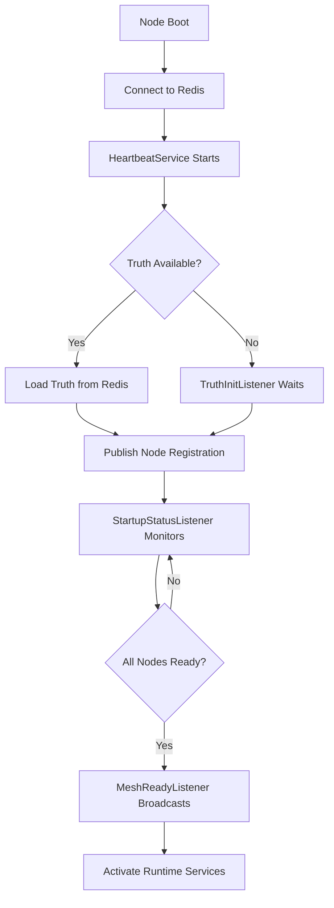

# # 🌿 ChainFeed Federated Startup Architecture  
### _Distributed Initialization and Coordination Design_  
**Author:** StudioTwo Build Lab / Convexity GPT  
**Version:** v1.0  
**Date:** 2025-10-26  

---

## 🧭 1. Overview  

### Purpose  
The **ChainFeed Federated Startup Architecture** defines how ChainFeed nodes — hubs, spokes, and federation controllers — discover, synchronize, and activate in a **distributed, event-driven startup system**.  

This replaces linear “boot scripts” with **reactive orchestration**, where nodes coordinate through Redis messages, canonical truth synchronization, and mesh listeners.  

---

## 🧩 2. Core Philosophy  

> “Startup is not a moment — it’s a negotiation.”  

Traditional startup models follow a strict sequence:  
`initialize → configure → run`.  

The ChainFeed Mesh replaces this with a **federated conversation**:  
- Nodes announce themselves.  
- Core truths are published or awaited.  
- Mesh topology is discovered dynamically.  
- Components self-synchronize before activation.  

The result is a **self-organizing system** that can scale, recover, and reconfigure without centralized control.  

---

## ⚙️ 3. Structural Overview  

### 3.1 Layered View  

| Layer | Description | Example Components |
|--------|--------------|--------------------|
| **Startup Layer** | Bootstraps and coordinates node initialization. | `StartupSequence`, `TruthService`, `HeartbeatService` |
| **Startup Listeners** | Observe orchestration signals and gate progression. | `TruthInitListener`, `StartupStatusListener`, `MeshReadyListener` |
| **Runtime Services** | Long-lived operational services. | `FeedService`, `SyntheticIndexService`, `ConvexityAgentService` |
| **Domain Listeners** | Observe live system data during runtime. | `FeedListener`, `HeartbeatMonitor`, `TruthListener` |
| **Canonical Truth** | Shared configuration and metadata published to Redis. | `truth:integration:schema` |
| **Mesh State Layer** | Tracks and announces node liveness and topology. | `truth:mesh:nodes`, `truth:mesh:state` |

---

## 🧱 4. Startup Architecture  

### 4.1 Process Flow  


# 🌿 ChainFeed Federated Startup Architecture  
### _Distributed Initialization and Coordination Design_  
**Author:** StudioTwo Build Lab / Convexity GPT  
**Version:** v1.0  
**Date:** 2025-10-26  

---

## 🧭 1. Overview  

### Purpose  
The **ChainFeed Federated Startup Architecture** defines how ChainFeed nodes — hubs, spokes, and federation controllers — discover, synchronize, and activate in a **distributed, event-driven startup system**.  

This replaces linear “boot scripts” with **reactive orchestration**, where nodes coordinate through Redis messages, canonical truth synchronization, and mesh listeners.  

---

## 🧩 2. Core Philosophy  

> “Startup is not a moment — it’s a negotiation.”  

Traditional startup models follow a strict sequence:  
`initialize → configure → run`.  

The ChainFeed Mesh replaces this with a **federated conversation**:  
- Nodes announce themselves.  
- Core truths are published or awaited.  
- Mesh topology is discovered dynamically.  
- Components self-synchronize before activation.  

The result is a **self-organizing system** that can scale, recover, and reconfigure without centralized control.  

---

## ⚙️ 3. Structural Overview  

### 3.1 Layered View  

| Layer | Description | Example Components |
|--------|--------------|--------------------|
| **Startup Layer** | Bootstraps and coordinates node initialization. | `StartupSequence`, `TruthService`, `HeartbeatService` |
| **Startup Listeners** | Observe orchestration signals and gate progression. | `TruthInitListener`, `StartupStatusListener`, `MeshReadyListener` |
| **Runtime Services** | Long-lived operational services. | `FeedService`, `SyntheticIndexService`, `ConvexityAgentService` |
| **Domain Listeners** | Observe live system data during runtime. | `FeedListener`, `HeartbeatMonitor`, `TruthListener` |
| **Canonical Truth** | Shared configuration and metadata published to Redis. | `truth:integration:schema` |
| **Mesh State Layer** | Tracks and announces node liveness and topology. | `truth:mesh:nodes`, `truth:mesh:state` |

---

## 🧱 4. Startup Architecture  

### 4.1 Process Flow  


⸻

**4.2 Sequence Timeline**
| **Phase** | **Responsible Components** | **Key Redis Keys** |
|:-:|:-:|:-:|
| **1. Redis Connect** | StartupSequence | — |
| **2. Heartbeat Emitter** | HeartbeatService | truth:heartbeat:{node_id} |
| **3. Canonical Truth Sync** | TruthService / TruthInitListener | truth:integration:schema |
| **4. Mesh Coordination** | MeshReadyListener / NodeRegistrationListener | truth:mesh:nodes, truth:mesh:ready |
| **5. Runtime Activation** | StartupOrchestrator | truth:system:startup_status |
| **6. Runtime Steady State** | FeedService, ConvexityAgentService | truth:* |

⸻

### 🧬 5. Listener Roles

**5.1 Startup Listeners (under core/startup/listeners/)**
| **Listener** | **Purpose** | **Behavior** |
|:-:|:-:|:-:|
| **TruthInitListener** | Blocks startup until canonical truth (truth:integration:schema) is present in Redis. | Polls or subscribes to Redis for truth availability, returns loaded schema. |
| **StartupStatusListener** | Monitors truth:system:startup_status to track multi-node startup progress. | Receives updates from each node’s orchestrator and logs progress. |
| **MeshReadyListener** | Waits for mesh readiness broadcast (truth:mesh:ready) before allowing runtime activation. | Acts as final synchronization gate before Convexity or feed activation. |
| **NodeRegistrationListener** | Detects node join/leave events during startup. | Updates truth:mesh:nodes set in Redis and logs mesh state changes. |

**5.2 Runtime Listeners (under core/listeners/)**
| **Listener** | **Purpose** | **Domain** |
|:-:|:-:|:-:|
| **HeartbeatMonitor** | Validates node liveness, triggers alerts on stale heartbeats. | Mesh health |
| **TruthListener** | Detects schema updates during runtime. | Canonical truth |
| **FeedListener** | Subscribes to live feed channels. | Market feeds |
| **SpotListener** | Watches synthetic index prices. | Synthetic feed |
| **ConvexityPromptListener** | Handles inbound prompt requests to ConvexityGPT. | AI interface |

⸻

### 🔄 6. Coordination Rules
1. **Blocking Dependencies:**
   * Components defined as "blocking": true in the truth schema must complete before downstream services activate.
   * Example: TruthService, MeshReadyListener.
2. **Asynchronous Components:**
   * Components marked "async": true may start independently.
   * Example: ConvexityInitService, FeedMonitor.
3. **Negotiated Components:**
   * Components marked "federated": true participate in mesh handshakes (e.g. node election or federation role assignment).
4. **Graceful Convergence:**
   * Each node publishes a final startup signal:
```json
truth:system:startup_status → { "node_id": "xyz", "status": "ready" }
```

	* Once all nodes are ready, the mesh emits truth:mesh:ready.

⠀
⸻

### 🧩 7. Canonical Truth Additions

New keys in canonical_truth.json to support federated startup:
```json
"startup": {
  "blocking_components": ["truth_service", "mesh_ready_listener"],
  "async_components": ["convexity_init_service", "provider_service"],
  "federated_components": ["mesh_agent", "node_registration_listener"],
  "grace_timeout_sec": 30
}
```

⸻

**🧠 8. Future Extensions**
| **Direction** | **Description** |
|:-:|:-:|
| **Federated Startup DAG** | Define startup dependencies as a graph for dynamic orchestration. |
| **Distributed Election Service** | Determine mesh hub / spoke roles at runtime. |
| **Adaptive Mesh Join** | Allow late-joining nodes to synchronize dynamically. |
| **Startup Replay Logs** | Persist startup events to Redis for audit or replay. |
| **AI-Aware Bootstrap** | ConvexityGPT assists in self-healing startup coordination. |

⸻

### 🪶 9. Path OS Reflection

“Startup is not a line but a pulse —
every node breathes on its own rhythm
until the mesh synchronizes into one heartbeat.”

In this system, **listeners become the ears of awakening**,
and **truth becomes the shared memory** of all nodes.
Startup itself becomes a form of emergence — a choreography of independent yet convergent action.

⸻

### 🧭 10. Summary

**Core Principles:**
* Startup is distributed and event-driven.
* Truth defines configuration, dependencies, and blocking rules.
* Listeners govern synchronization between asynchronous components.
* Redis serves as the coordination bus for all startup events.
* ConvexityGPT becomes aware of system state for orchestration assistance.

⠀
**Result:**
A self-aware, self-coordinating distributed system —
capable of federated startup, graceful recovery, and dynamic scaling.